##  Spring Cloud 最新可视化组件

 Spring Cloud 可视化组件！以下是它的核心亮点：

- **Spring Boot 3.4.2**：采用最新版本的 Spring Boot，确保系统高效稳定。
- **JDK 17+**：兼容 Java 17 及以上版本，充分利用现代 Java 的强大特性。
- **Spring Cloud 2024.0.0**：集成 Spring Cloud 2024.0.0，带来前沿的微服务支持。
- **Docker Compose 一键部署**：只需一条命令，即可轻松完成部署，省时省力。
- **轻量镜像编译**：优化后的镜像体积更小，编译和运行更快，节省资源。
- **在线体验**：立即访问 [https://www.techkid.top/echo-admin/login](https://www.techkid.top/echo-admin/login)，试用基础 OAuth 认证模块。由于服务器资源有限，目前仅部署了核心功能

```
├── boo                                             springcloud config 配置文件
│   ├── dispace-dev.properties
│   ├── dispace-prod.properties
│   └── dispace-test.properties
├── bus                                             消息总线配置文件
│   └── bus-dev.properties
├── docker-compose.yml                              docker一键启动微服务
├── spring-ai                                       spring-ai模块
├── spring-cloud-alibaba                            alibaba模块（待完善）
│   ├── config
│   ├── loadbalancer
│   ├── nacos
│   ├── open-feign
│   ├── seata
│   └── sentinel
├── spring-cloud-bus                                消息总线组件
│   ├── bus-service-a
│   ├── bus-service-b
│   ├── bus-service-c
│   └── 测试流程.txt
├── spring-cloud-circuitbreaker                     服务断路器
├── spring-cloud-config                             服务配置中心
│   ├── config-client
│   ├── config-server
├── spring-cloud-eureka                             注册中心
│   ├── eureka-consummer
│   ├── eureka-loadbalance                          负载均衡
│   ├── eureka-provider
│   ├── eureka-server
├── spring-cloud-gateway
├── spring-cloud-openfeign                          服务网关
├── spring-cloud-stream                             事件驱动服务
├── spring-cloud-tracing                            链路追踪 zipkin
│   ├── service-consumer
│   └── service-provider
└── spring-security                                 springsecurity自定义服务完成oauth认证
    ├── oauth-client
    ├── oauth-server
```
### 认证
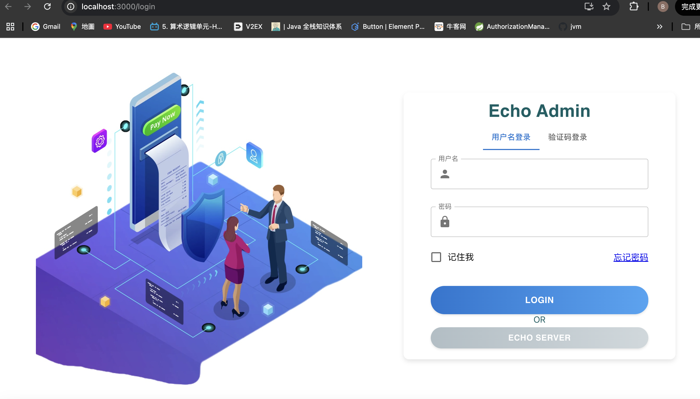
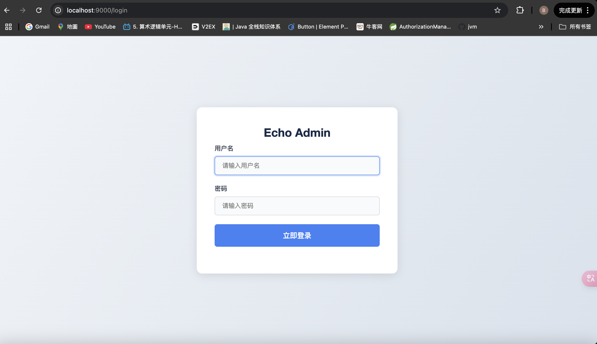
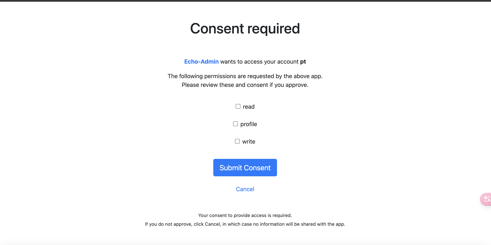

### 注册中心
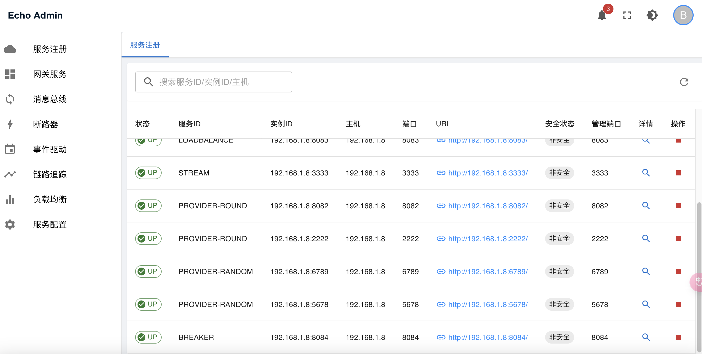
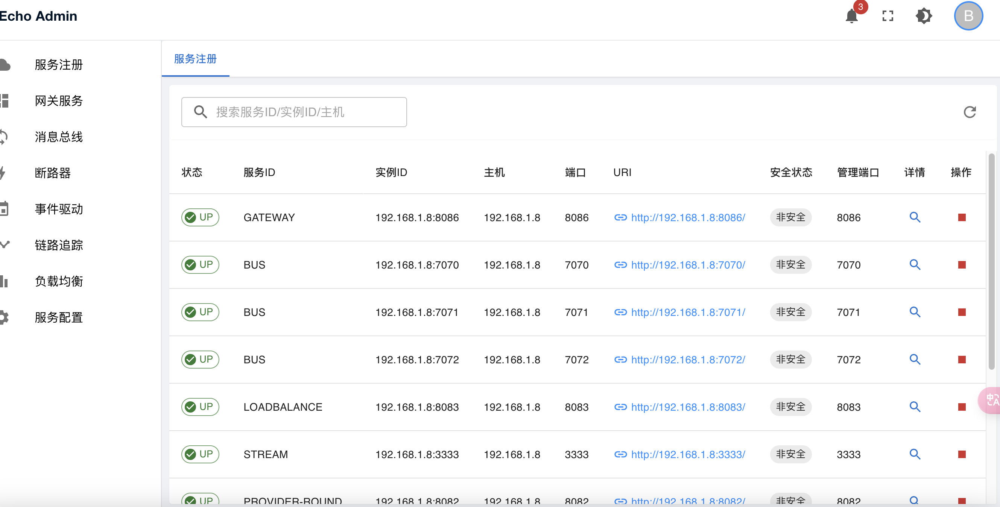

### 网关
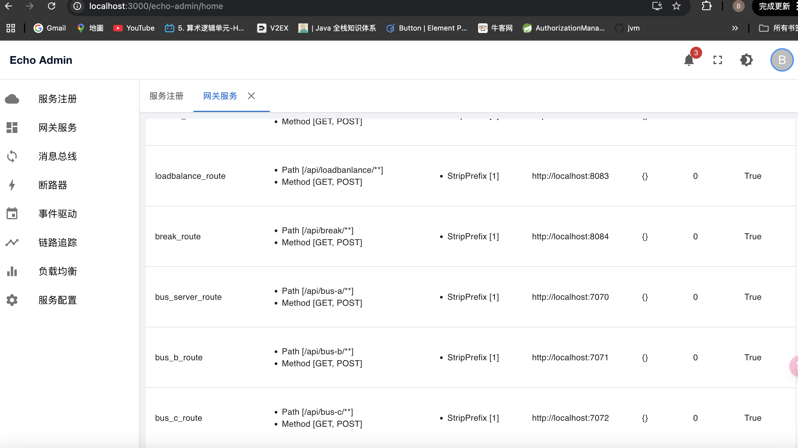
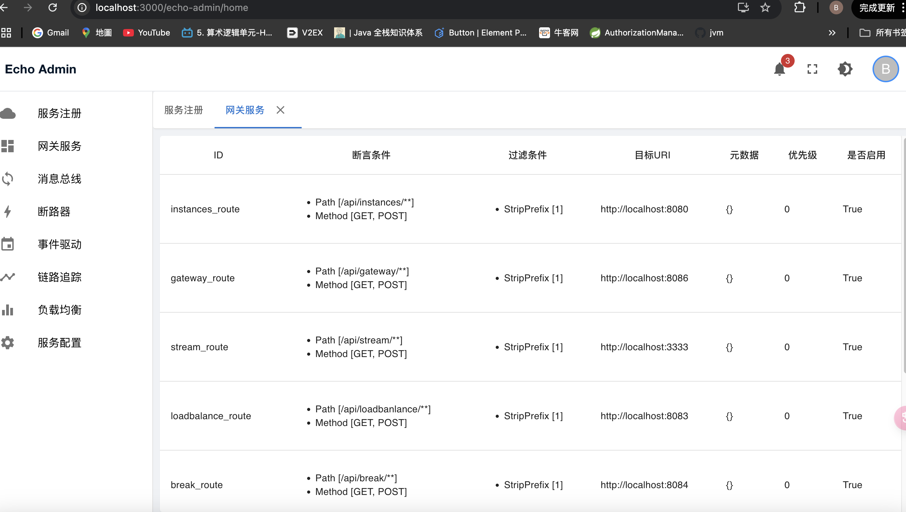

### 配置中心


### 负载均衡
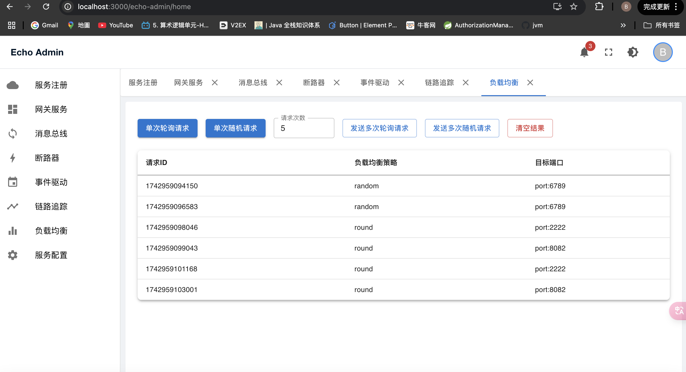

### 断路器
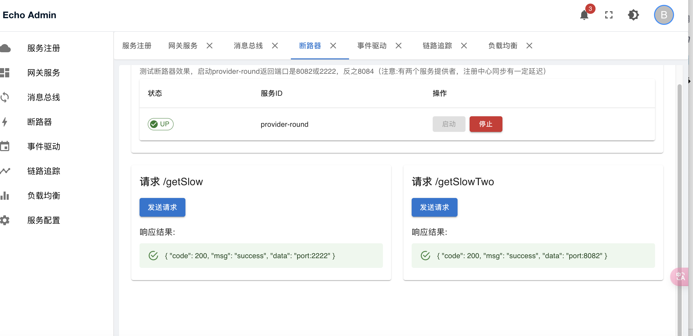
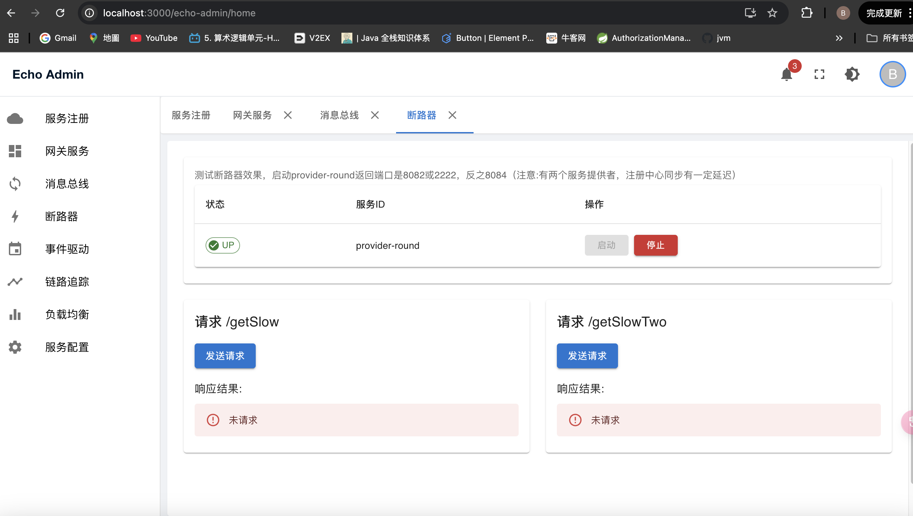

### 消息总线
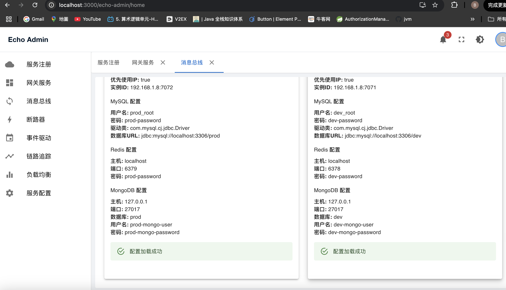
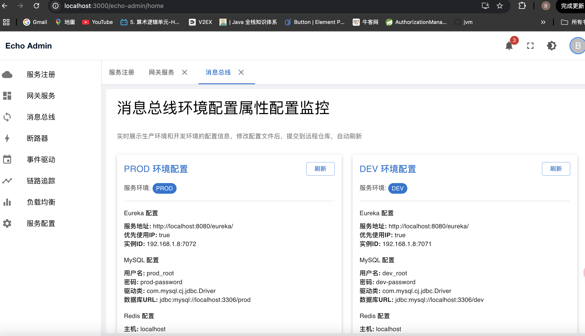

### 消息驱动
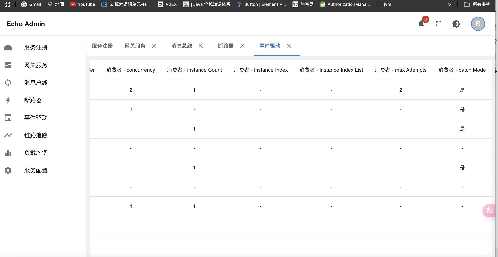
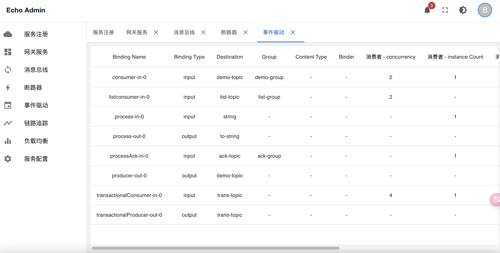

### 链路追踪
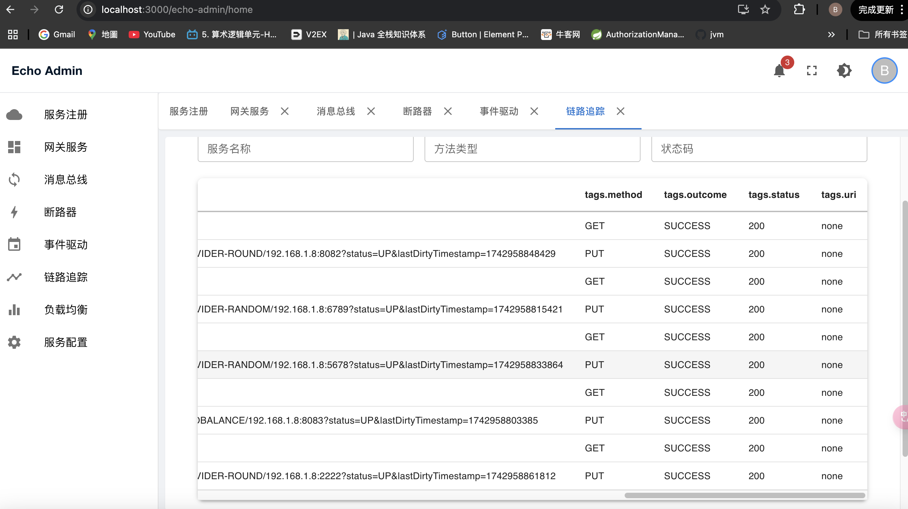
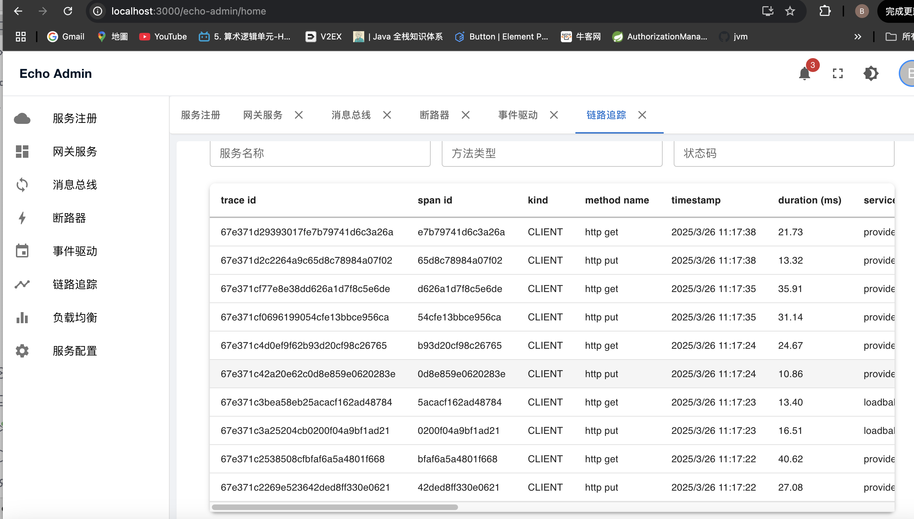
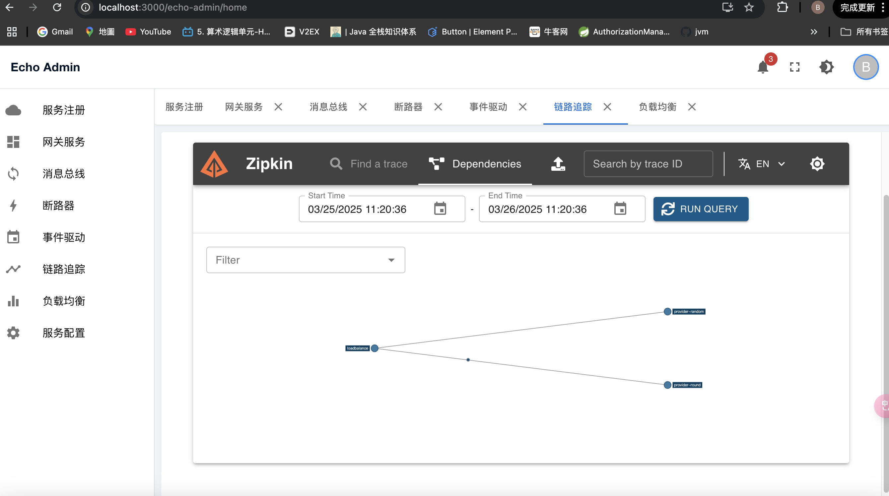


